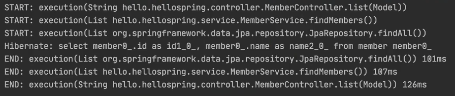

# Membership management service with Web MVC

### Project Settings
 - Gradle Project
 - Java 11
 - Jar
 - Spring Boot 2.5.4
 - Dependencies
   - Spring Web
   - Thymeleaf


### Build & Execute
```
$ ./gradlew clean build
$ cd build/libs
$ java -jar hello-spring.jar
```


### Libraries
Gradle은 의존 관계가 잇는 라이브러리를 함께 다운로드 한다.
1. Spring Boot Library 
   - spring-boot-starter-web
     - spring-boot-starter-tomcat (Web Server)
     - spring-webmvc 
   - spring-boot-starter-thymeleaf (Template Engine)
   - spring-boot-starter(common : spring boot + spring core + logging)  
     - spring-boot
       - spring-core
     - spring-boot-starter-logging
       - logback, slf4j

2. Test Library
   - junit
   - mockito
   - assertj 
   - spring-test 


### Web Development 
- Static contents
    - resources/staic/hello-static.html
    - http://localhost:8080/hello-static.html 
- MVC pattern and template engine
     ```
    @GetMapping("hello-mvc")
    public String helloMvc(@RequestParam("name") String name, Model model) {
        model.addAttribute("name", name);
        return "hello-template";
    }
     ```
  - resources/template/hello-template.html
  - ViewResolver 
  - http://localhost:8080/hello-mvc?name=spring
- API
    ```
    @GetMapping("hello-string")
    @ResponseBody
    public String helloString(@RequestParam("name") String name) {
        return "hello " + name;
    }
    ```
  - HttpMessageconverter 
  - http://localhost:8080/hello-string?name=spring


### Membership Management Service 
- Controller
  - MemberController
- Service (business logic)
  - MemberService
    - join()
    - findMembers()
    - findOne()
- Repository
  - MemberRespository (Interface)
    - save()
    - findById()
    - findByName()
    - findAll()
  - MemoryMemberRepository
- Domain
  - Member
  

### Spring bean and Dependency
스프링 빈을 등록하는 2가지 방법 
- 스프링은 스프링 컨테이너에 스프링 빈을 등록할 때, 기본으로 싱글톤으로 등록한다.
1. Component scan
- @Component 어노테이션이 있으면 스프링 빈으로 자동 등록된다.
- @Autowired를 통한 DI는 스프링이 관리하는 객체에서만 동작한다.
- @Controller
  - @Autowired : Member Service Dependency Injection
- @Service
  - @Autowired : Member Repository Dependency Injection
- @Repository

2. By Code 
- SpringConfig
    ```
    @Bean
    public MemberService memberService() {
        return new MemberService(memberRepository());
    }
    @Bean
    public MemberRepository memberRepository() {
        return new MemoryMemberRepository;
    }
    ```


### Database 
- H2 database
    ```
    $ cd /h2/bin
    $ chmod 755 h2.sh
    $ ./h2.sh
    
    How to create database file?
    jdbc:h2:~/test
    ~/test.mv.db 
    jdbc:h2:tcp://localhost/~/test
    ```
  - https://stackoverflow.com/questions/30320854/java-net-connectexception-connection-refused-connect-localhost
  
- JDBC
  - build.gradle에 spring-boot-starter-jdbc 주입
  - application.properties에 datasource 설정
  - JdbcMemberRepository 구현
  - SpringConfig에서 DI
  ```
    private DataSource dataSource;
    
    @Autowired
    public SpringConfig(DataSource dataSource){
        this.dataSource = dataSource;
    }
    
    @Bean
    public MemberRepository memberRepository() {
        // return new MemoryMemberRepository;
        return new JdbcMemberRespository;
    }
    ```
  - Open-Closed Principle : Spring DI 사용하면 기존 코드를 수정하지 않고, 설정만으로 구현 클래스를 변경 가능하다. 

- Spring JdbcTemplate
  - JdbcTemplateMemberRepository
  - JDBC API에서 본 반복 코드 제거. SQL은 직접 작성해야 한다.
  
- JPA 
  - build.gradle에 spring-boot-starter-data-jpa 주입
  - application.properties에 jpa 관련 설정
  - JpaMemberRepository
    - EntityManager 
    - @Transactional
  - SpringConfig에서 DI
  ```
    private EntityManager em;
    
    @Autowired
    public SpringConfig(EntityManager em){
        this.em = em;
    }
    
    @Bean
    public MemberRepository me mberRepository() {
        // return new MemoryMemberRepository;
        // return new JdbcMemberRespository;
        return new JpaMemberRepository(em);
    }
    ```
    
- Spring Data JPA
  - SpringDataJpaMemberRepository
  ```
  public interface SpringDataJpaMemberRepository extends JpaRepository<Member, Long>, MemberRepository {

    @Override
    Optional<Member> findByName(String name);
  }
  ```
  - 인터페이스를 통한 JpaRepository CRUD 구현

  
### Aspect Oriented Porgramming
- cross-cutting convern 과 core concern 분리 
- TimeTraceAop에서 시간 측정 로직을 공통 로직으로 분리
- AOP 적용 후 의존 관계 helloController -> proxy memberService -> joinPoint.proceed() -> memberService
   

